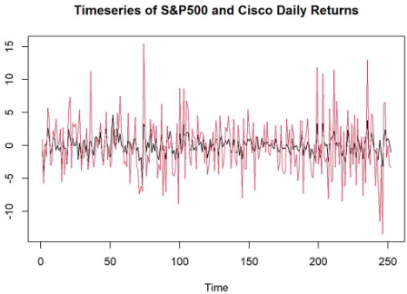

## Portfolio

---

### Predictive Analytics For Financial Markets 

[Capital Asset Pricing Model (CAPM) For Cisco](/sample_page)

---
[Predictive Analytics For Financial Markets](/pdf/Predictive Analytics.pdf)

---
[Project 3 Title](http://example.com/)

---

### Project List

- [Capital Asset Pricing Model (CAPM) For Cisco](https://meneabe.github.io/sample_page/)
- [Predictive Analytics For Financial Markets Presentation](https://meneabe.github.io/pdf/Predictive%20Analytics.pdf)
- [Project 3 Title](http://example.com/)
- [Project 4 Title](http://example.com/)
- [Project 5 Title](http://example.com/)

---

---

Page template forked from <a href="https://github.com/evanca/quick-portfolio">evanca</a>

<!-- Remove above link if you don't want to attibute -->
