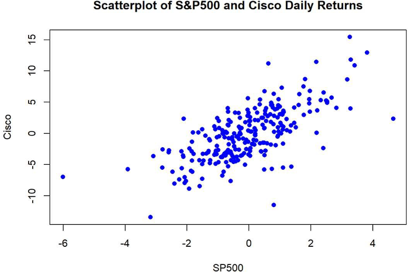
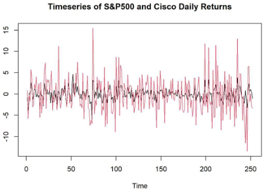

## Cisco

**Project description:** This is a predictive analytics using the capital asset pricing model (CAPM) which is a simple asset pricing model in finance. CAPM is a linear regression model.

<!DOCTYPE html>
<html lang="en">
<head>
    <meta charset="UTF-8">
    <meta name="viewport" content="width=device-width, initial-scale=1.0">
    CAPM Explanation
</head>
<body>
    <h1>Capital Asset Pricing Model (CAPM)</h1>
    <p>The capital asset pricing model (CAPM) is a simple asset pricing model in finance given by:</p>
    <p><strong>y<sub>i</sub> = β<sub>0</sub> + β<sub>1</sub>x<sub>i</sub> + e<sub>i</sub></strong></p>
    <p>where y<sub>i</sub> is a stock return and x<sub>i</sub> is a market return at time i.</p>
    <p>Some remarks are the following:</p>
    <ul>
        <li>β<sub>1</sub> measures the market-related (or systematic) risk of the stock.</li>
        <li>Market-related risk is unavoidable, while firm-specific risk may be 'diversified away' through hedging.</li>
        <li>Variance is a simple measure (and one of the most frequently-used) of risk in finance.</li>
    </ul>
</body>
</html>

<!DOCTYPE html>
<html lang="en">
<head>
    <meta charset="UTF-8">
    <meta name="viewport" content="width=device-width, initial-scale=1.0">
    
</head>
<body>
    <h1>Capital Asset Pricing Model, CAPM</h1>
    <p>I applied the simple linear regression model to study the relationship between two series of financial returns – a regression of Cisco Systems stock returns, y, on S&P500 index returns, x (CAPM).</p>
    <p>Stock returns are defined as:</p>
    <p><strong>return = (current price - previous price) / previous price ≈ log(current price / previous price)</strong></p>
    <p>when the difference between the two prices is small.</p>
    <p>The data file ‘Returns.csv’ contains daily observations over a January - 29 December 2000 (i.e., n=252 returns). The dataset has 5 columns: Day, S&P500 return, Cisco return, Intel return and Sprint return.</p>
</body>
</html>




We can see that Cisco and S&P 500 is highly correlated which satisfies the assumption that the independent variable should be correlated with the dependent variable.




<!DOCTYPE html>
<html lang="en">
<head>
    <meta charset="UTF-8">
    <meta name="viewport" content="width=device-width, initial-scale=1.0">
    
</head>
<body>
    <h1>Capital Asset Pricing Model, CAPM</h1>
    <p>I fitted the regression model: Cisco = β<sub>0</sub> + β<sub>1</sub>S&P500 + ε.</p>
    <p>The rationale is that part of the fluctuation in Cisco returns was driven by the fluctuation in the S&P500 returns.</p>
    <pre>
> reg <- lm(Cisco ~ SP500)
> summary(reg)

Call:
lm(formula = Cisco ~ SP500)

Coefficients:
            Estimate Std. Error t value Pr(>|t|)    
(Intercept)  -0.04547    0.19433   -0.234    0.815    
SP500         2.00715    0.13900   14.943   <2e-16 ***
---
Signif. codes:  0 ‘***’ 0.001 ‘**’ 0.01 ‘*’ 0.05 ‘.’ 0.1 ‘ ’ 1

Residual standard error: 3.083 on 205 degrees of freedom
Multiple R-squared: 0.4718, Adjusted R-squared: 0.4697
F-statistic: 223 on 1 and 204 DF, p-value: < 2.2e-16
    </pre>
</body>
</html>

<!DOCTYPE html>
<html lang="en">
<head>
    <meta charset="UTF-8">
    <meta name="viewport" content="width=device-width, initial-scale=1.0">
    
</head>
<body>
    <h1>Capital Asset Pricing Model (CAPM)</h1>
    <p>The estimated slope is β<sub>1</sub> = 2.07715. The null hypothesis H<sub>0</sub>: β<sub>1</sub> = 0 is rejected with a p-value of 0.000 (to three decimal places). Therefore, the test is extremely significant.</p>
    <p>The interpretation is that when the market index goes up by 1%, Cisco stock goes up by 2.07715%, on average. However, the error term ε in the model is large with an estimated σ<sub>ε</sub> = 3.083%.</p>
    <p>The p-value for testing H<sub>0</sub>: β<sub>0</sub> = 0 is 0.815, so we cannot reject the hypothesis that β<sub>0</sub> = 0. Recall β<sub>0</sub> = y - β<sub>1</sub>x and both y and ε are very close to 0.</p>
    <p>R<sup>2</sup> = 47.18%, hence 47.18% of the variation of Cisco stock may be explained by the variation of the S&P 500 index, or, in other words, 47.18% of the risk in Cisco stock is the market-related risk.</p>
</body>
</html>

### 1. Suggest hypotheses about the causes of observed phenomena

Part of the fluctuation in Cisco returns is driven by fluctuations in the S&P500 returns.

### 2. Assess assumptions on which statistical inference will be based

Based on the data and hypothesis that part of the fluctuation in Cisco returns is driven by fluctuations in the S&P500 returns, I made five(5) assumptions about the data and variables.

Linearity: The relationship between the predictor variable (S&P500) and the dependent variable (Cisco) is linear.

Scatter plot:

```
import matplotlib.pyplot as plt
plt.scatter(S&P500, Cisco)
plt.xlabel('Scatterplot of Stock and Market returns')
plt.ylabel('Cisco')
plt.show()
```
Residual plot:
After fitting the regression model, plot residuals versus the fitted values.

```
plt.scatter(model.fittedvalues, model.residuals)
plt.xlabel('Fitted values')
plt.ylabel('Residuals')
plt.axhline(0, color='red', linestyle='--')
plt.show()
```
Independence: Observations are independent of each other.

Durbin-Watson Test

```
from statsmodels.stats.stattools import durbin_watson
dw = durbin_watson(model.residuals)
print(f'Durbin-Watson: {dw}')
```

Homoscedasticity: The variance of the residuals is constant across all levels of the predictor variable. This means there is no heteroscedasticity.

Residual Plot:
I used the same residual plot to check if residuals have constant variance.

```
plt.scatter(model.fittedvalues, model.residuals)
plt.xlabel('Fitted values')
plt.ylabel('Residuals')
plt.axhline(0, color='red', linestyle='--')
plt.show()
```
Breusch-Pagan Test:

```
from statsmodels.compat import lzip
from statsmodels.stats.diagnostic import het_breuschpagan
test_stat, p_value, _, _ = het_breuschpagan(model.residuals, model.model.exog)
print(f'Breusch-Pagan test stat: {test_stat}, p-value: {p_value}')
```

Normality: The residuals are normally distributed.

Histogram of Residuals:

```
plt.hist(model.residuals, bins=30)
plt.show()
```

Q-Q Plot:

```
import statsmodels.api as sm
sm.qqplot(model.residuals, line='45')
plt.show()
```

Shapiro-Wilk Test:

```
from scipy.stats import shapiro
stat, p = shapiro(model.residuals)
print(f'Statistic={stat}, p-value={p}')
```

No Multicollinearity: The predictor variables are not highly correlated (if there are multiple predictors). But correlation between each predictor variable and the dependent variable should be high. That is correlation between S&P500, Intel and Sprint should be low but correlation between S&P500 and Cisco should be high.

Variance Inflation Factor (VIF):

```
from statsmodels.stats.outliers_influence import variance_inflation_factor
vif = [variance_inflation_factor(X.values, i) for i in range(X.shape[1])]
print(f'VIF: {vif}')
```

Correlation Matrix:

```
import seaborn as sns
corr_matrix = X.corr()
sns.heatmap(corr_matrix, annot=True)
plt.show()
```

### 3. Support the selection of appropriate statistical tools and techniques
Based on the hypothesis and assumptions, I selected linear regression as the statistical tool and technique which will be used to test whether part of the fluctuation in Cisco returns is explained by fluctuations in S&P500 returns. The dependent variable is Cisco returns and the predictor variable is S&P500.

### 4. Provide a basis for further data collection through surveys or experiments

Since the conclusion is that part (47%) of the fluctuations in Cisco returns is explained by fluctuations in S&P500 returns, a multiple linear regression can be used to test whether the remainder of the variation in Cisco returns is explained by earnings per share (EPS) and a price to earnings (P/E) ratio.

For more details see [GitHub Flavored Markdown](https://guides.github.com/features/mastering-markdown/).
